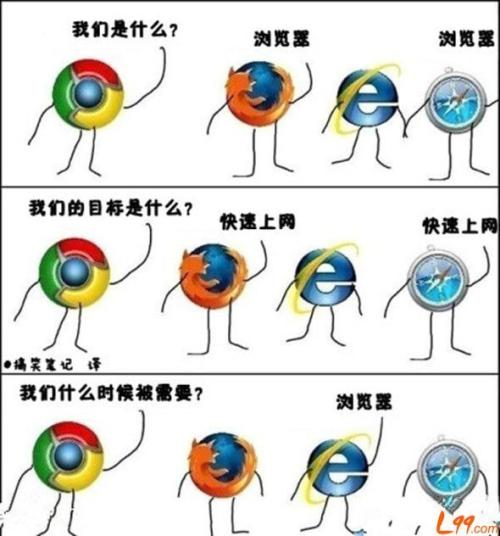

# 🔥 《HTTP》有了这本剑法，让你轻松面对面试比武场。(上篇)

我是一名前端开发工程师(笑)，作为一名天天每天混迹在Web、浏览器、网络传输上的江湖之人，有一门拿得出手的剑法变得十分重要，而且在互联网飞速发展的今天，几乎每门每派招收内门弟子都需要你有一门拿的出手的武功秘籍。

既然你今天走到这里了，那么一定不要忘记看一看老夫的 《HTTP》剑法。没准可以帮你应对门派大师兄。

## 初识 HTTP 心法

我们想要学习这门剑法，首先就要先了解 HTTP 剑法的起源。

那是 1960 年，由`泰德·纳尔森(Ted·Nelson)`提出，1989年时，`蒂姆·伯纳斯·李(Tim·Berners·Lee)`在 CERN 开发的一套程序，奠定了万维网的基础，也就是他将我们耳熟能详的 http://www 留给了我们。

我们回归主题，众所周知 HTTP 是一种`超文本传输协议（Hypertext Transfer Protocol）`, 但是在比武场上只会这一招，明显会被打到半死。所以我们要在比武场尽可能的会更多招式，才能招架得住每一个杀招。

那么什么是超文本传输协议？

超文本传输协议，我们从字面上进行切割，`超文本（Hypertext）、传输（Transfer）、协议（Protocol）`。超文本传输协议则是由它们三个组成。

### 超文本

在很早很早以前，我们输入的信息都保存在本地，无法和其他终端进行交互，那时候我们保存的信息通畅都以`字符`的形式存在，这些字符是一种能够被计算机解析的二进制数据包。

但是随着互联网的高速发展，两台设备之间能够进行数据的传输后，人们已经不满足传输文字，而开始想要看P站、B站、掘金上的相亲图片、想听虾米音乐、甚至想看到缩略图点击就要进行`超链接`跳转。

这时文本的语义就被扩大，而这种被扩大的语义则被称为 `超文本（Hypertext）`。

### 传输

什么是传输？

在之前我们提到，慢慢的，两台终端之间开始需要通讯，需要传递信息。

那么我们存储的超文本就会被解析为机器能够读懂的二进制数据包，通过传输载体（光纤、电话线、同轴电缆 等。。）输送给另一台终端。

这个过程称之为 `传输（Transfer）`

通常，我们把发送请求的一方称之为请求方，把接收到二进制包的一方称之为应答方。请求方和应答方可以进行内力互换，请求方也可以作为应答方接收数据，应答方也可以变成请求方请求数据。

### 协议

协议，互联网中的协议与我们日常生活中的协议是一样的，比如一对程序员约定好了在元旦同事向github提交代码。那么这个约定就是一个协议。

再或者，你答应了女朋友去游乐园玩，你女朋友答应了闺蜜去游乐园玩，女朋友闺蜜又答应你去游乐园玩，那么这也是一个协议。（也可能你们没有女朋友，但是不要心痛，我有的）

注意，协议不能使你自己对自己做出的约定，而必须是多人同时遵守的约定。

那么由此可知，网络协议实际上就是网络中传递，管理信息的规范，计算机之间通过该约定互相通信。这些规则统称为通信协议。

### 什么是HTTP？

通过上述信息，我们可以得出一个结论， HTTP是一个渣。。啊不， HTTP是一个在计算机世界中专门用于两点之间传输文字，音频，视频，图片等超文本数据的约定和规范。

## 与HTTP有着关联的事物

### 浏览器

大家经常使用的电子邮件，遵循了SMTP协议，浏览器则使用HTTP协议作为主要载体。

浏览器大多数情况作为HTTP的请求方。

### Web服务器

Web服务器的英文名叫做 Web Server， Web服务器一般指网站服务器，Web 服务一般做着应答方的角色。

Web服务器可以向浏览器等客户端提供文本，也可以放置文件让其他人进行浏览，又或者可以放置数据文件，让其他人进行下载。

目前主流的Web服务器有：Nginx、Apache、IIS。

### CDN

CDN 的全程是 `Content Delivery Network`，既`内容分发网络`，它应用了HTTP协议里的缓存与代理机制，代替源站响应客户端的请求，它依靠部署在各地的边缘服务器，进行内容分发，负载均衡等功能模块，让用户可以就近获取所需要的内容，减少网络堵塞，进一步提高用户的访问速度与命中率。

### WAF

WAF 全称（Web Application Firewall）。

是一种Web应用防护系统。它通过执行针对HTTP/HTTPS的 安全策略来为Web应用提供保护。

WAF通常在服务器之前，可以有效阻止跨站脚本和SQL注入等攻击。

### WebService

WebService 是一种由 W3C 定义的应用服务开发协议没通常使用WSDL定义服务接口，使用HTTP协议传输XML 或者 SOAP消息，它是一个基于 HTTP的服务架构技术，既可以在内网中运行，也可以在适当保护后放在外网运行。

### HTML

HTML几乎所有前端都很了解，这里就不多做赘述。

## 小结

本期主要为大家解释了 HTTP的由来以及什么是HTTP，并且介绍了一部分与HTTP有关联的事物。

下一期则会为大家带来《HTTP》剑法中的协议。

参考文献：

[WEB服务器](https://baike.baidu.com/item/WEB%E6%9C%8D%E5%8A%A1%E5%99%A8/8390210?fr=aladdin)

[内容分发网络](https://baike.baidu.com/item/%E5%86%85%E5%AE%B9%E5%88%86%E5%8F%91%E7%BD%91%E7%BB%9C/4034265)
